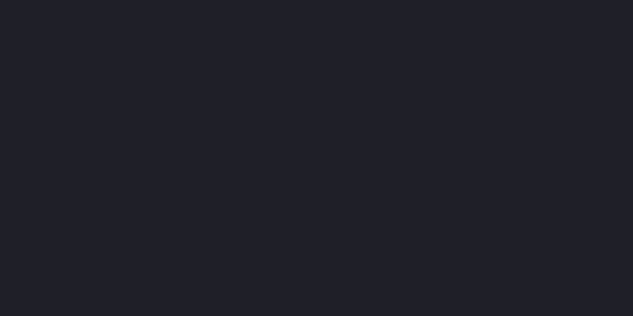
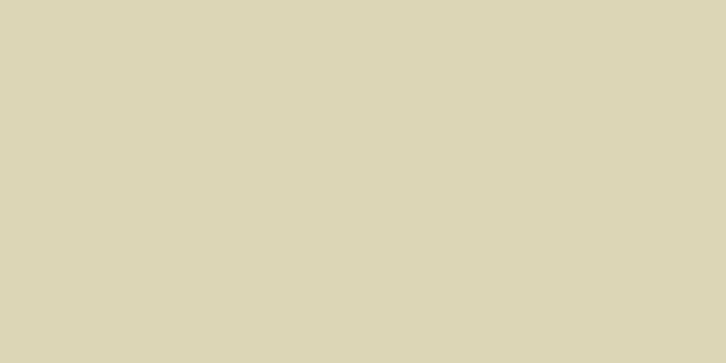

# Kanagawa Zed Themes

Zed themes inspired by the [Kanagawa VS Code theme](https://github.com/metaphorforwinter/kanagawa-vscode-color-theme), featuring blur/transparency effects. Based on the colors of the famous painting by Katsushika Hokusai.

### Wave Dark

### Wave Light

## Installation

1. Open `Command Palette`
2. Select `zed: extensions`
3. Search `Kanagawa Wave Blur`

## Activate Theme

1. Open `Command Palette`
2. Select `theme selector: toggle`
3. Search `Kanagawa Wave`

## Contributing

Feel free to fork, make changes, and submit a pull request.
