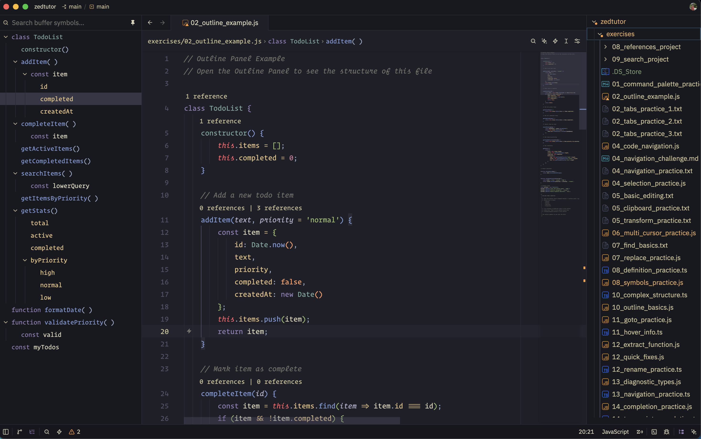
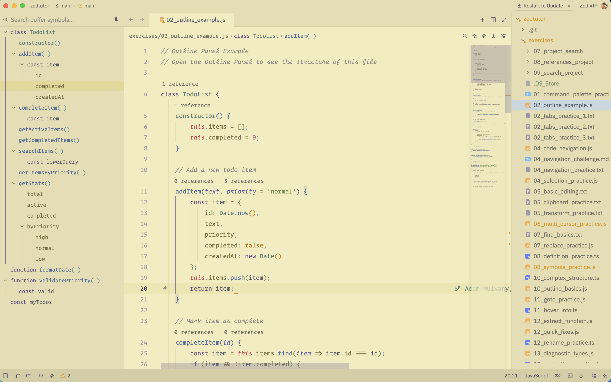

# Kanagawa for Zed

Zed themes from the [Kanagawa](https://github.com/rebelot/kanagawa.nvim) palette, based on Hokusai's *Great Wave off Kanagawa*.

| Theme | Appearance |
| --- | --- |
| **Wave** | Dark. Official sumi-ink background. |
| **Wave Blur** | Dark, transparent, `background.appearance: blurred`. |
| **Dragon** | Darker, warmer, lower saturation. Easier on the eyes for long sessions. |
| **Lotus** | Light. Warm parchment. |

### Wave

### Lotus

## Install

1. Command Palette → `zed: extensions`
2. Search `Kanagawa`

Or clone this repo into `~/.config/zed/themes/` while developing.

## Activate

Command Palette → `theme selector: toggle` → `Kanagawa Wave`, `Kanagawa Wave Blur`, `Kanagawa Dragon`, or `Kanagawa Lotus`.
